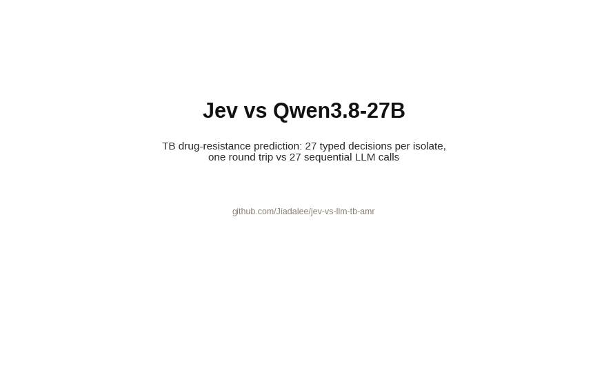
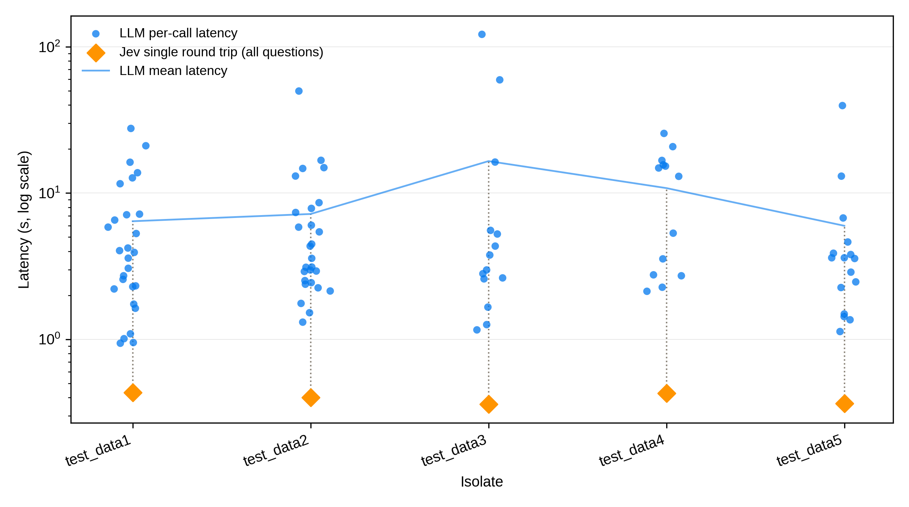

# jev-vs-llm-tb-amr

[](https://doi.org/10.5281/zenodo.TODO)
[](LICENSE)

**Catalog-grounded tuberculosis drug-resistance prediction: a "System One" decision model (Jev) versus a generative LLM (Qwen3.8-27B) on identical evidence.**

> Cite this work via the "Cite this repository" button on GitHub (powered by
> [`citation.cff`](citation.cff)). To get a real DOI badge, mint one free at
> [Zenodo](https://zenodo.org) and replace the placeholder above.

This repo reproduces a head-to-head comparison of two ways to answer the same 27 typed
drug-resistance questions per *Mycobacterium tuberculosis* isolate:

| Arm | Design | Latency profile |
|---|---|---|
| **Jev** (TypeSafe AI, hosted Decision API) | All 27 typed `choice` questions in **one round trip**; returns calibrated typed answers — no free text | ~0.4 s per isolate |
| **Qwen/Qwen3.8-27B** (OpenRouter, vLLM-backed) | **27 sequential chat calls**, one per drug decision, strict-JSON prompt | 6–17 s per call; 96–232 s per isolate |

The design principle under test: **filter first in code, send only what the question needs;
judgment = model, facts = code.** The WHO catalogue lookup and question construction are
deterministic code; the model only judges the pre-filtered evidence.



*The animated race cycles through all five isolates: the Jev lane (orange) completes every
decision in a single ~0.4 s round trip while the Qwen lane (blue) lands one decision per
frame, paced by the real recorded per-call latency; green = agree, red = disagree.*

## Headline results (5 isolates, 97 decisions)

| Isolate | Items | Agreement | Jev (s) | Qwen (s) | Gap |
|---|---|---|---|---|---|
| test_data1 | 27 | 27/27 (100%) | 0.6 | 173.5 | 313× |
| test_data2 | 27 | 26/27 (96%) | 0.5 | 194.4 | 392× |
| test_data3 | 14 | 13/14 (93%) | 0.6 | 231.8 | 390× |
| test_data4 | 13 | 13/13 (100%) | 0.6 | 140.8 | 244× |
| test_data5 | 16 | 16/16 (100%) | 0.5 | 95.7 | 178× |

**95/97 (98%) overall agreement.** Both observed disagreements run the same direction: the
live LLM returned `unknown` on WHO Assoc-1 (resistance-associated) items while both arms
agreed `unknown` on genuinely uncertain items. Non-catalogue "bait" mutations
(*katG* R463L, *gyrA* A384V, *gyrA* V668L) are dropped by the code filter and never reach
either model — the documented fix for ungrounded LLM runs answering from their own beliefs.



> **Caveat:** the Qwen arm ran fully live; the **Jev arm ran in calibrated mock mode**
> (deterministic conservative heuristic + simulated ~0.4 s round trip) because no valid
> `jv_live_...` key was available. All Jev outputs are labeled `jev-mock` in the raw JSONs.
> Rerun live with a valid key using the commands below.

## Quickstart

```bash
# 1. Environment
python3 -m venv .venv && source .venv/bin/activate   # or: uv venv .venv
pip install -r requirements.txt

# 2. Jev arm (~1 s/sample live; add --mock for the offline calibrated mock)
export JEV_API_KEY=jv_live_...    # from jevtypesafeai.com pricing page
python3 predict_amr_catalog.py --sample data/test_data1.json --outdir results/test_data1
python3 predict_amr_catalog.py --sample data/test_data2.json --outdir results/test_data2

# 3. LLM arm (~3 min/sample live; any OpenAI-compatible endpoint)
export LLM_API_KEY=sk-or-v1-...
python3 predict_amr_llm.py --sample data/test_data1.json --outdir results/test_data1 \
    --model Qwen/Qwen3.8-27B --base-url https://openrouter.ai/api/v1/chat/completions
python3 predict_amr_llm.py --sample data/test_data2.json --outdir results/test_data2 \
    --model Qwen/Qwen3.8-27B --base-url https://openrouter.ai/api/v1/chat/completions

# 4. Compare (default output: results/model_comparison.txt)
python3 compare_models.py --results-dir results --samples test_data1 test_data2

# 5. Regenerate the animated race GIF (needs imageio)
python3 scripts/make_race_gif.py
```

Keys are read from environment variables only and are never written to files or logs.

## Repo layout

```
├── predict_amr_catalog.py   # Jev arm: 1 typed-questions call; timing.decision_call_s/attribution_s/total_s
├── predict_amr_llm.py       # LLM arm: 27 sequential calls; per-drug seconds + total
├── compare_models.py        # agreement + runtime lines -> model_comparison.txt
├── amr_common.py            # catalogue filter, evidence state, report renderer
├── scripts/make_race_gif.py # animated accuracy/speed race from real latency traces
├── data/                    # WHO 2021 catalogue subset (44 entries) + 5 isolate profiles
├── results/                 # raw JSONs, per-sample reports, comparison tables, figures
└── docs/                    # full walkthrough + extended-results addendum (.docx)
```

## Data

- `data/who_catalogue.json` — curated 44-entry subset of the WHO 2021 catalogue of
  *M. tuberculosis* mutations and their drug-resistance associations (9 drugs; Assoc 1 =
  resistance-associated, Assoc 3 = uncertain). Not the complete catalogue.
- `data/test_data1–5.json` — reconstructed isolate variant profiles (gene, amino-acid change,
  nucleotide change, read depth, alt fraction). Each isolate yields a fixed set of decision
  items via the catalogue filter (13–27 per isolate).

## Limitations

Reconstructed (not real WGS) isolates; catalogue subset; n = 97 decisions is a pipeline
validation, not a validation study; agreement is inter-model, **not** accuracy against
phenotypic DST; the Jev arm is simulated pending a live key; LLM latency/cost is
nondeterministic (reasoning length varied 1–120 s/call). Not a diagnostic — clinical use
requires laboratory validation and human review. See `docs/` for the full discussion.
